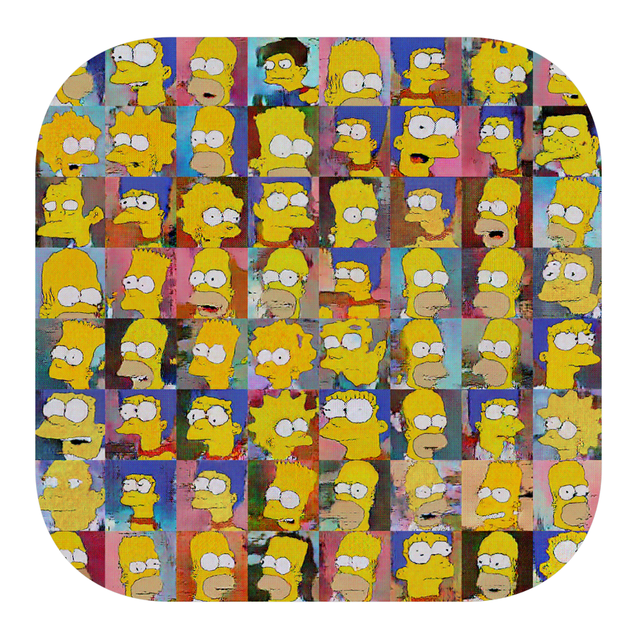
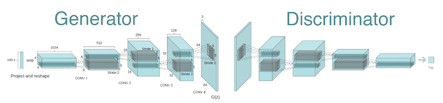

<h3 align="center">
  
</h3>

# Image Generator

Python notebook containing TensorFlow DCGAN implementation. It was trained on a [Simpsons Faces](https://www.kaggle.com/kostastokis/simpsons-faces) dataset.

 

Check out corresponding Kaggle kernel: [Image Generator](https://www.kaggle.com/greg115/image-generator-dcgan-the-simpsons-dataset).

Check out corresponding Medium article:

[Image Generator - Drawing Cartoons with Generative Adversarial Networks](https://towardsdatascience.com/image-generator-drawing-cartoons-with-generative-adversarial-networks-45e814ca9b6b)

<h3 align="center">
  
</h3>

## DCGAN
Network architecture by [Radford et al., 2015](https://arxiv.org/abs/1511.06434).

